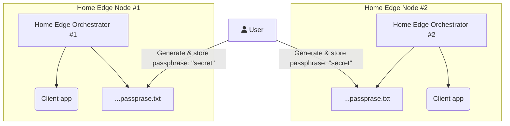

# CRIB

```mermaid
graph TD
	A[fa:fa-user User] -->|Generate & store passphrase: ''secret''| Storage1(Home Edge Orchestrator #1)
	A[fa:fa-user User] -->|Generate & store passphrase: ''secret''| Storage2(Home Edge Orchestrator #2)
    
subgraph Home Edge Node #2
    HEO2[Home Edge Orchestrator #2]-->Storage2[...passprase.txt]
    HEO2[Home Edge Orchestrator #2]-->CAPP2(Client app)
end	

subgraph Home Edge Node #1
    HEO1[Home Edge Orchestrator #1]-->CAPP1(Client app)
    HEO1[Home Edge Orchestrator #1]-->Storage1[...passprase.txt]
end	

```

[Shell]: (shell/README.md)
