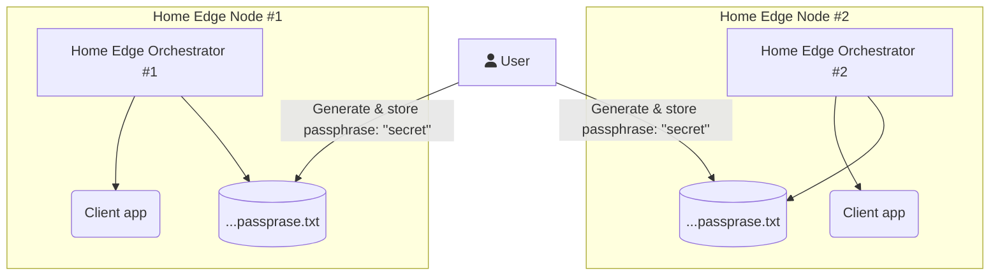

# CRIB

## Contents
1. [Introduction](#1-introduction)
2. [License](#2-license)
3. [Shell script](#3-shell-script-template)
4. [C template](#4-c-template)
5. [Makefile template](#5-makefile-template)
6. [Doxygen](#6-doxygen)

---
## 1. Introduction
The `crib git` contains simple examples and file templates for quick start of
implementation programs, etc.

---
## 2. License
The software is distributed mostly under the free license.

## 3. Shell script template
This part contains references to the documentation, the shell script template
and shell script code style.

## 4. C template
This part contains the `*.c` and `*.h` template, several examples and etc.

## 5. Makefile template
This part contains references to the documentation, the Makefile template.

## 6. Doxygen
This part contains references to the documentation and example how to use
doxygen tool.

[Shell]: (shell/README.md)
