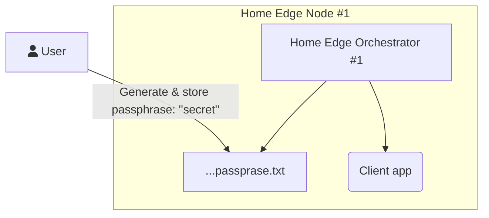

# CRIB



```plantuml

@startuml

top to bottom direction

actor User

node "Home Edge Node #1" {
  User --> [f1] : Generate & store ''secret''
  [HOM1] --> [f1] 
  [CA1] --> [f1] 
  [HOM1] <--> [HOM2]
  rectangle "/var/edge-orchestration/data/jwt/passprasejwt.txt" as f1 {
  }
  rectangle "App" as CA1 {
  }
  rectangle "Home Edge Orchestrator" as HOM1 {
  }
}
node "Home Edge Node #2" {
  User --> [f2] : Generate & store ''secret''
  [HOM2] --> [f2] 
  [CA2] --> [f2] 
  folder "/var/edge-orchestration/data/jwt/passprasejwt.txt" as f2 {
  }
  rectangle "App" as CA2{
  }
  rectangle "Home Edge Orchestrator" as HOM2 {
  }
}


scale 600 width

[*] -> State1
State1 --> State2 : Succeeded
State1 --> [*] : Aborted
State2 --> State3 : Succeeded
State2 --> [*] : Aborted
state State3 {
  state "Accumulate Enough Data\nLong State Name" as long1
  long1 : Just a test
  [*] --> long1
  long1 --> long1 : New Data
  long1 --> ProcessData : Enough Data
}
State3 --> State3 : Failed
State3 --> [*] : Succeeded / Save Result
State3 --> [*] : Aborted
@enduml
```
[Shell]: (shell/README.md)
