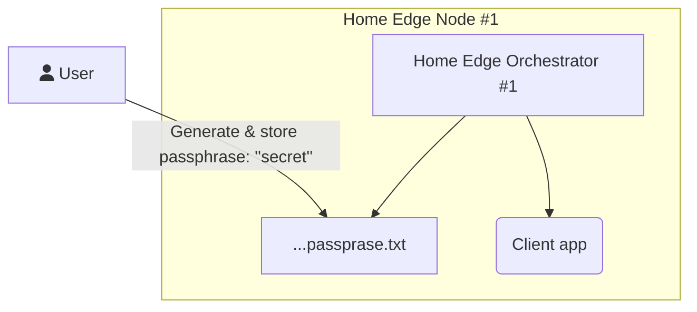

# CRIB

```mermaid
graph TD
	A[fa:fa-user User] -->|Generate & store passphrase: ''secret''| Storage1(Home Edge Orchestrator #1)
    
subgraph Home Edge Node #1
    HEO1[Home Edge Orchestrator #1]-->CAPP1(Client app)
    HEO1[Home Edge Orchestrator #1]-->Storage1[...passprase.txt]
end	

```

<!--
@startuml firstDiagram

Alice -> Bob: Hello
Bob -> Alice: Hi!
	
@enduml
-->

[Shell]: (shell/README.md)
