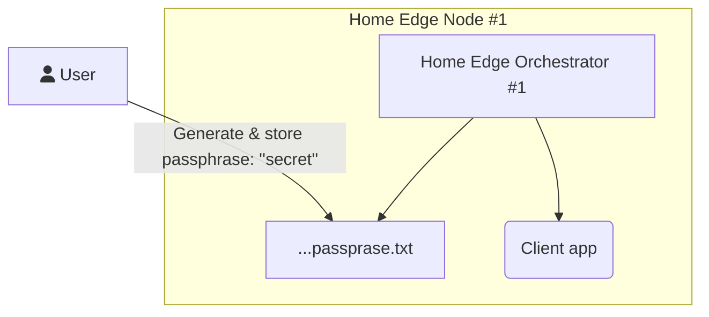
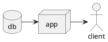

# CRIB



```plantuml
@startuml
!include <tupadr3/common>
!include <tupadr3/font-awesome/server>
!include <tupadr3/font-awesome/database>

title Styling example
FA_SERVER(web1,web1) #Green
FA_SERVER(web2,web2) #Yellow
FA_SERVER(web3,web3) #Blue
FA_SERVER(web4,web4) #Yellow

GreenFA_DATABASE(db1,LIVE,database,white) #RoyalBlue
FA_DATABASE(db2,SPARE,database) #Red
db1 <--> db2
web1 <--> db1
web2 <--> db1
web3 <--> db1
web4 <--> db1
@enduml
```

[Shell]: (shell/README.md)
